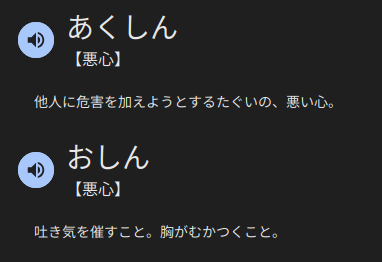

## 機能性ディスペプシア（Functional Dyspepsia: FD）

お目通しいただきありがとうございます。
長いのでざっとご確認いただけると幸いです。

### 概要

この 機能性ディスペプシアは、日本人の**10人に1人**が罹患していると言われている比較的よくある病気です。
[(参考](https://www.onaka-kenko.com/various-illnesses/stomach/stomach_10.html)

**命にかかわる深刻な疾患ではありません**が、症状が強い場合は日常生活に大きな影響を及ぼすことがあります。

かといって全く仕事ができなくなったりということは今までもございませんので、その点はご安心ください。

我が家では、「ディプ」という愛称で親しまれております。

### お願い

症状がひどい場合には座っていることができなくなり、急に強制散歩タイムが始まります。

私の症状は見た目にはわかりにくいことが多いため、周囲の方々にご心配をおかけすることがあるかもしれませんが、
全く心配はございませんので、温かい気持ちで散歩に送り出してくださるか、もしくは、一旦ガン無視していただけると幸いです。
(たいてい 事前に一言 「ディプったので散歩してきます」と申し上げます)

現在は家族のかかりつけ医と専門的な治療を受けながら、
少しずつ症状をコントロールできるよう努力しています。

### 私の症状

私のこれまでの症状をまとめると以下のようになります。

- 症状:

胸焼け, 吐き気のような悪心

- 発生タイミング:

食後30分~1時間

半年に一回程度 ごく稀に深夜睡眠時

転職時期 や 連日残業 などストレスが継続してかかる時期

(通常、全く発生せず、もともと三ヶ月に一回あるかどうか程度でした)

- 発生期間:

1時間ほど継続

- 程度:

ストレスの度合いによってかなり差がある

軽度であれば、なにかつっかえている程度

重度であれば、止まっていられず場合によっては震えが伴う (散歩開始の合図

### 対策

- 刺激の強い食べ物や脂肪の多い食事、アルコール、カフェインなどを避ける

- 1日の食事量や1回の食事量を見直す

- 睡眠や休息を十分に取る

- 胃酸の出過ぎを抑える薬や消化管の運動機能を調整する薬、ストレスを和らげる薬などを服用する
-> 以下はすでにいくつか処方されていて効果があったものです

1. [クロチアゼバム錠 5mg](https://medical.nikkeibp.co.jp/inc/all/drugdic/prd/11/1179012F1169.html)
即効性があるので、いざというときに使える
2. [半夏瀉心湯](https://medical.nikkeibp.co.jp/inc/all/drugdic/prd/52/5200123D1079.html)
食前に服用することでかなり症状を抑えれる

どうでもよすぎる話

どうでもいいですが、ずっと悪心をあくしんだと思っていましたが、おしんでした

